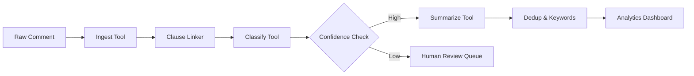

# NeetiManthan - AI-Powered Public Comment Analysis System

An intelligent agentic system for analyzing public comments on draft laws and policies. NeetiManthan automates sentiment analysis, clause linking, summarization, deduplication, and provides comprehensive analytics to help policy makers understand public feedback efficiently.

## 🎯 Problem Statement

Manual review of thousands of public comments on draft laws is:
- **Time-consuming**: Analysts spend weeks reading through comments
- **Inconsistent**: Human bias affects sentiment interpretation  
- **Error-prone**: Important comments can be missed
- **Unscalable**: Can't handle large volumes effectively

## 🚀 Solution

NeetiManthan uses an **agentic architecture** with a coordinator that orchestrates specialized AI tools:

### Core Components

- **🔧 Ingest Tool**: PII masking, language detection, text normalization
- **🔗 Clause Linker**: Links comments to relevant draft clauses using regex + semantic similarity
- **🎭 Classify Tool**: Multi-label sentiment, stance, and aspect analysis (XLM-RoBERTa)
- **📝 Summarize Tool**: Generates neutral 1-2 sentence summaries (mT5)
- **🔍 Dedup Tool**: Clusters similar comments using HDBSCAN
- **🔑 Keywords Tool**: Extracts key terms and phrases (TF-IDF + KeyBERT)
- **📊 Analytics**: Real-time dashboards and comprehensive reports

### Architecture

```
Raw Comments → Ingest → Clause Link → Classify → Summarize → Analytics
                ↓         ↓           ↓         ↓
              PII Mask   Embeddings  Sentiment  Dedup → Dashboard
```

## 🏃‍♂️ Quick Start

### Prerequisites
- Docker & Docker Compose
- 8GB+ RAM (for AI models)
- 10GB+ disk space

### 1. Clone and Setup
```bash
git clone <repository-url>
cd NeetiManthan_C
cp env.example .env  # Review and customize settings
```

### 2. Start Services
```bash
# Easy startup with all services
./scripts/start.sh

# Or manually with Docker Compose
docker-compose up -d
```

### 3. Run Demo
```bash
# Wait for services to be ready, then run demo
python3 scripts/demo.py
```

### 4. Access Interfaces
- **API Docs**: http://localhost:8000/docs
- **Main API**: http://localhost:8000/api/v1/
- **MinIO Console**: http://localhost:9001 (admin/minioadmin123)

## 🎮 Demo Walkthrough

The demo script showcases the complete workflow:

1. **Creates a draft** of "Companies Amendment Rules 2024"
2. **Uploads 20 sample comments** from various stakeholders
3. **Processes comments** through the AI pipeline
4. **Shows analytics**: sentiment distribution, clause mapping, keywords
5. **Exports results** to CSV for further analysis

```bash
python3 scripts/demo.py
```

Expected output:
```
📊 Analytics for draft:
   📝 Total Comments: 20
   ✅ Processed: 20
   📈 Processing Rate: 100.0%
   🎯 Average Confidence: 0.82
   😊 Sentiment Distribution:
      • positive: 8
      • negative: 6  
      • neutral: 6
   🎭 Stance Distribution:
      • supports: 7
      • opposes: 5
      • neutral: 8
```

## 🏗️ System Architecture

The system follows a **microservices architecture** with clear separation of concerns:

### Services Overview

| Service | Port | Purpose | Technology |
|---------|------|---------|------------|
| API Gateway | 8000 | Main API, RBAC | FastAPI |
| Ingest Tool | 8001 | PII masking, language detection | FastText, RegEx |
| Classify Tool | 8002 | Sentiment analysis | XLM-RoBERTa |
| Clause Linker | 8003 | Semantic clause matching | Sentence Transformers |
| Summarize Tool | 8004 | Text summarization | mT5-small |
| PostgreSQL | 5432 | Primary database | PostgreSQL + pgvector |
| Redis | 6379 | Task queue, caching | Redis |
| MinIO | 9000 | Object storage | MinIO |

### Data Flow

1. **Comment Ingestion** → Raw comments stored with metadata
2. **PII Masking** → Sensitive information redacted
3. **Language Detection** → Automatic language identification
4. **Clause Linking** → Comments mapped to relevant draft sections
5. **AI Classification** → Sentiment, stance, and aspects extracted
6. **Summarization** → Neutral summaries generated
7. **Deduplication** → Similar comments clustered
8. **Analytics** → Real-time dashboards updated

## 📊 Key Features

### ✅ Implemented (MVP)

- **Multi-language Support**: Hindi, English, Urdu detection
- **PII Protection**: Automatic masking of emails, phones, Aadhaar, PAN
- **Intelligent Clause Linking**: Regex + semantic similarity matching
- **Sentiment Analysis**: Positive/Negative/Neutral with confidence scores
- **Stance Detection**: Supports/Opposes/Neutral classification
- **Aspect Analysis**: 10 policy aspects (clarity, cost, timeline, etc.)
- **Smart Summarization**: Template-based + AI-generated summaries
- **Deduplication**: HDBSCAN clustering of similar comments
- **Keyword Extraction**: TF-IDF + KeyBERT phrase mining
- **Real-time Analytics**: Clause-wise sentiment, word clouds
- **Export Capabilities**: CSV/JSON exports with full analysis
- **Audit Trail**: Complete change tracking
- **Confidence Scoring**: Calibrated confidence intervals

### 🔄 Processing Pipeline



## 🎯 Impact & Benefits

### For Policy Makers
- **40%+ time savings** in comment analysis
- **Consistent labeling** without human bias
- **Nothing missed** - comprehensive coverage
- **Quick insights** - clause-wise sentiment at a glance

### For Citizens  
- **Transparent process** - all comments processed fairly
- **Faster response** - quicker policy decisions
- **Better representation** - minority opinions highlighted

### For Analysts
- **Focus on high-value work** - less manual reading
- **Data-driven insights** - quantified feedback
- **Audit trail** - complete transparency

## 🛠️ Development

### Local Development
```bash
# Install dependencies
pip install -r requirements.txt

# Run individual services
cd app/tools/classify && python main.py  # Classification service
cd app/tools/ingest && python main.py   # Ingestion service

# Run tests
pytest tests/

# Code formatting
black . && isort .
```

### Adding New Features

1. **New Tool Service**: Create in `app/tools/new_tool/`
2. **Update Coordinator**: Add tool call in `app/services/coordinator.py`
3. **Add API Endpoints**: Extend routes in `app/api/`
4. **Database Changes**: Create migration in `alembic/versions/`

### Configuration

Key settings in `.env`:
```bash
# AI Models
SENTIMENT_MODEL=cardiffnlp/twitter-xlm-roberta-base-sentiment
EMBEDDING_MODEL=sentence-transformers/paraphrase-multilingual-MiniLM-L12-v2

# Processing
CONFIDENCE_THRESHOLD=0.7  # Comments below this go to human review
SIMILARITY_THRESHOLD=0.92 # Deduplication threshold
MAX_CLAUSE_CANDIDATES=5   # Max clauses per comment
```

## 📈 Performance Metrics

### Target Performance (MVP)
- **Sentiment Classification**: <150ms p50, F1≥0.80
- **Summarization**: <900ms p50 (async)
- **Throughput**: 1000+ comments/hour  
- **Accuracy**: 80%+ sentiment accuracy
- **Calibration**: ECE ≤ 0.05

### Scalability
- **Horizontal scaling**: Stateless tool services
- **Queue management**: Redis-based async processing
- **Database optimization**: Indexed queries, connection pooling
- **Caching**: Redis caching for frequent queries

## 🔒 Security & Compliance

- **PII Protection**: Automatic detection and masking
- **On-premise Deployment**: No data leaves your infrastructure  
- **Audit Logging**: Complete trail of all changes
- **RBAC**: Role-based access control
- **Data Encryption**: At rest and in transit

## 🚀 Deployment

### Production Deployment
```bash
# Update configuration for production
cp env.example .env.production
# Edit .env.production with production settings

# Deploy with production compose
docker-compose -f docker-compose.prod.yml up -d

# Run migrations
docker-compose exec api alembic upgrade head
```

### Kubernetes Deployment
```bash
# Apply Kubernetes manifests
kubectl apply -f k8s/

# Check deployment status
kubectl get pods -l app=neetimanthan
```

## 📚 API Documentation

### Core Endpoints

```bash
# Health check
GET /api/v1/health

# Create draft
POST /api/v1/drafts
{
  "title": "Draft Title",
  "content": "Full draft text..."
}

# Upload comments (bulk)
POST /api/v1/comments/bulk
{
  "draft_id": "uuid",
  "comments": [{"text": "comment text", "meta": {...}}]
}

# Get analytics
GET /api/v1/analytics/drafts/{draft_id}/summary
GET /api/v1/analytics/drafts/{draft_id}/clause-analysis  
GET /api/v1/analytics/drafts/{draft_id}/keywords

# Export results
GET /api/v1/analytics/drafts/{draft_id}/export?format=csv
```

Full API documentation available at: `http://localhost:8000/docs`

## 🤝 Contributing

1. Fork the repository
2. Create feature branch: `git checkout -b feature/amazing-feature`
3. Commit changes: `git commit -m 'Add amazing feature'`
4. Push to branch: `git push origin feature/amazing-feature`
5. Open Pull Request

## 📄 License

This project is licensed under the MIT License - see the LICENSE file for details.

## 🙏 Acknowledgments

- **Hugging Face** for transformer models
- **Sentence Transformers** for multilingual embeddings  
- **FastAPI** for the excellent web framework
- **PostgreSQL + pgvector** for vector similarity search

---

**Built with ❤️ for better governance and citizen engagement**
